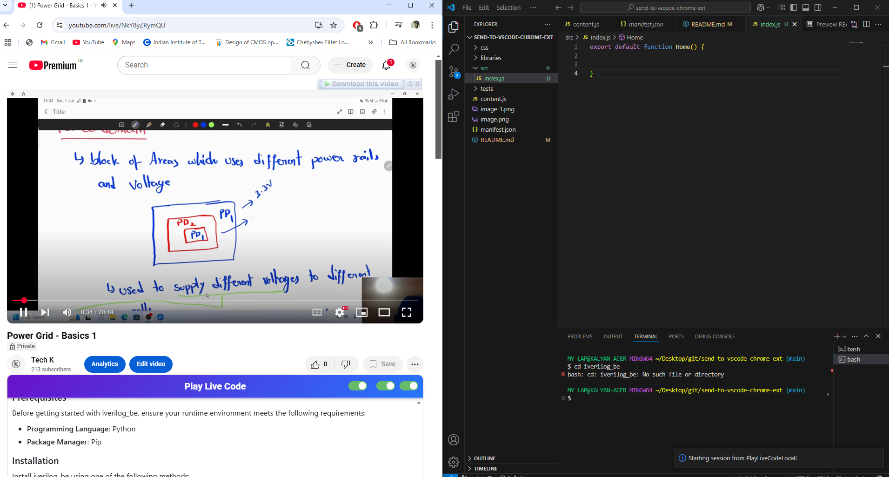

# Play Live Code

Play Live Code is a browser content script designed to enhance YouTube pages by dynamically integrating a GitHub repository’s README into the video page. It not only displays the README with GitHub-style markdown rendering but also provides live code execution features synchronized with video playback.

## Features

- **Dynamic README Integration:**  
  Fetches the README.md from a GitHub repository (detected from the video description) and renders it on the YouTube page with proper styling.

- **Responsive Positioning:**  
  The README container can be repositioned either to the right of the video or below it. Users can toggle the position via an on-screen control, with the setting saved in local storage.

- **WebSocket Code Execution:**  
  Establishes a persistent WebSocket connection (defaulting to `ws://localhost:9182`) to send code snippets for execution.  
  - Queues code if the connection isn’t ready.
  - Displays on-screen alerts upon successful execution.

- **Auto Code Execution:**  
  Supports special auto-execution commands embedded in the markdown. These commands, annotated with timestamps, are automatically sent to the WebSocket server when the video playback reaches the specified time.

- **Insert Code Commands:**  
  Parses special commands that allow inserting code into files (using parameters like `FILEPATH` and `SEARCHSTRING`) at designated video times.

- **Auto-Scroll Synchronization:**  
  When the README includes scroll-marked sections (using specific HTML comments), the script automatically scrolls the content in sync with the video playback.

- **Interactive Code Blocks:**  
  Each code block is enhanced with a red dot and an "Execute Code" button. Users can manually trigger the execution of a code snippet by clicking the button.
## Snapshots
- 
## How It Works

1. **Initialization:**  
   The script waits for key YouTube elements to load (e.g., the video description). It then extracts a GitHub repository link from the description.

2. **Fetching & Processing the README:**  
   - The script attempts to fetch the README from the repository’s `main` branch, falling back to `master` if necessary.
   - It transforms special markdown markers to wrap scroll sections and parses auto-execution and insert commands from the content.
   - The processed markdown is converted to HTML (using the [marked](https://github.com/markedjs/marked) library) and inserted into a dynamically created container on the page.

3. **User Interaction & Synchronization:**  
   - Toggle buttons in the README header allow users to switch between readme positions, enable/disable auto-scroll, and toggle auto code execution.
   - Listeners on the video element track playback time to trigger auto-execution and adjust scrolling based on the defined markers.

4. **WebSocket Communication:**  
   - A persistent WebSocket connection is maintained. When ready, any queued code is sent for execution.
   - Alerts are displayed to inform the user about successful code execution.

## Installation

1. **Prerequisites:**
   - A local WebSocket server listening on `ws://localhost:9182` that can handle the incoming code execution and insert commands.
   - The [marked](https://github.com/markedjs/marked) library must be loaded on the page for markdown conversion.

2. **Adding the Script:**
   - Integrate the script as part of your browser extension or user script.
   - Ensure the script is injected into YouTube pages where video descriptions may contain GitHub links.

## Usage

- **Automatic README Loading:**  
  Once loaded, the script automatically locates a GitHub repository link in the video description, fetches the README, and inserts it into the page.

- **Toggling Features:**  
  - **Readme Position:** Use the toggle in the header to switch between a right-side panel and a bottom placement.
  - **Auto Scroll:** Enable or disable auto-scroll based on video progress.
  - **Auto Code Execution:** Turn on/off auto-execution of code snippets synchronized with the video.

- **Manual Code Execution:**  
  Hover over a code block’s red dot to reveal the “Execute Code” button and click it to send the code to the WebSocket server.

## Configuration

- **Local Storage:**  
  The script uses local storage to remember user preferences such as readme position and auto-scroll settings.

- **Custom Command Markers:**  
  - **Auto-Execution Commands:**  
    Format in markdown using:

    `<!--START:PLAYLIVECODE TIME=30s-->`
    ```js
    // Your code here
    ```
    `<!--END:PLAYLIVECODE-->`
  - **Insert Commands:**  
    Format in markdown using:
    
    `<!--START:INSERT PLAYLIVECODE FILEPATH='path/to/file' SEARCHSTRING='some string after which you wish to add' TIME=45s-->`
    ```javascript
    // Code to insert
    ```
    `<!--END:INSERT PLAYLIVECODE-->`

## Testing
- Clone this repo
- Go to Extensions and click Load Unpacked extensions and select this repo
- Give access to this extension in tool bar
- Add github repo link for in description of the youtube video tutorial
- Modify README.md in the above format
- Enable Third toggle button to Execute the code in Sync
- Dowlonad Play live Code vs extension and start seesion with Ctrl + Shift + p and search for Start Session
## Contributing

Contributions, improvements, and bug reports are welcome! Feel free to open an issue or submit a pull request to help enhance the script.
This is inspired from [https://teachflow.app](https://teachflow.app)

## License

This project is licensed under the [MIT License](LICENSE).

---

*This script is designed for educational and development purposes. Ensure you have proper security measures in place when executing remote code or integrating with local services.*

# send-to-vscode-chrome-ext

1. Able to detect code and fetch the code from github pages and send it to console
2. Not able to send it to wesocket yet 

Steps to setup this chorom extension 
clone the repo and go to chrome extensions and select load unpacked extensions and select this repo


old v2


old v1

