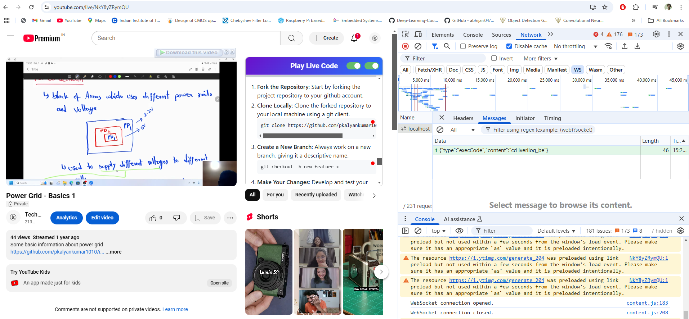
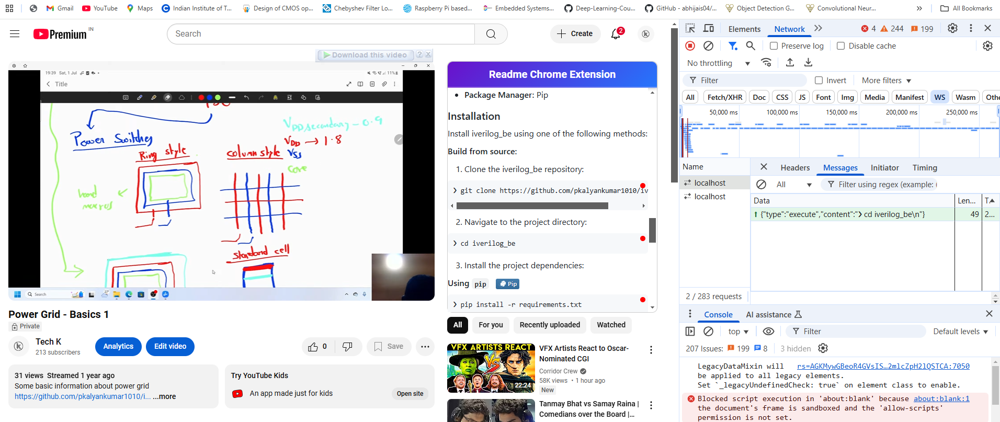

# send-to-vscode-chrome-ext

1. Able to detect code and fetch the code from github pages and send it to console
2. Not able to send it to wesocket yet 

Steps to setup this chorom extension 
clone the repo and go to chrome extensions and select load unpacked extensions and select this repo

old v2

old v1

